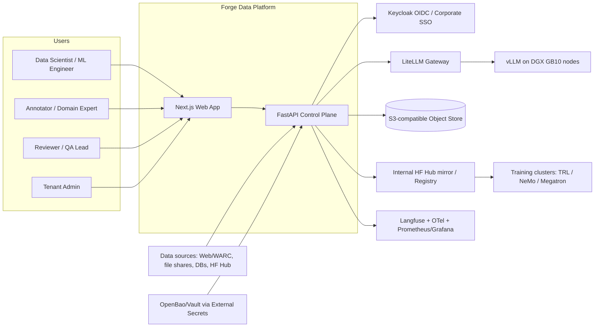
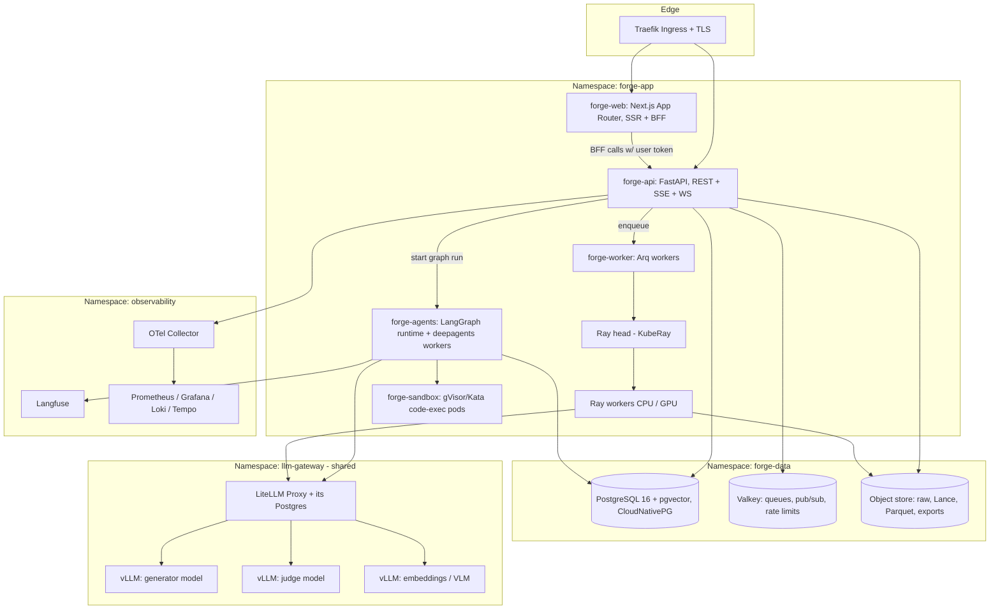
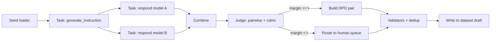
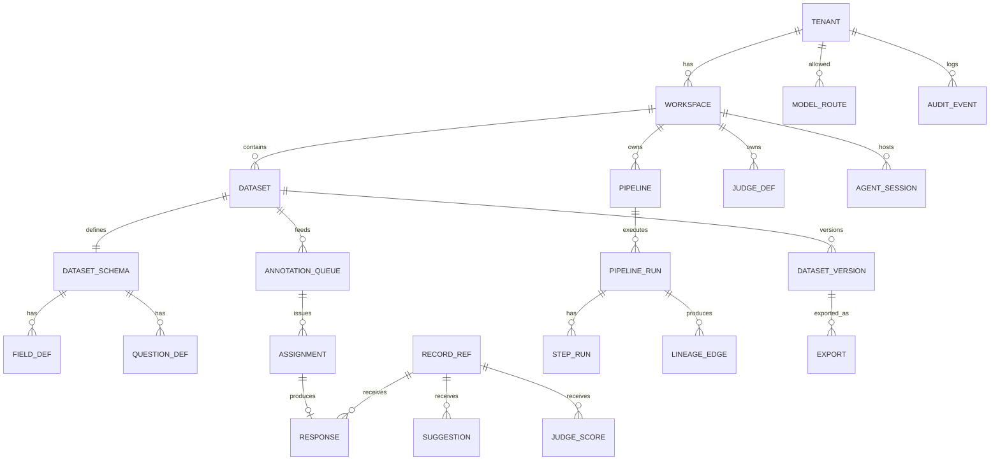
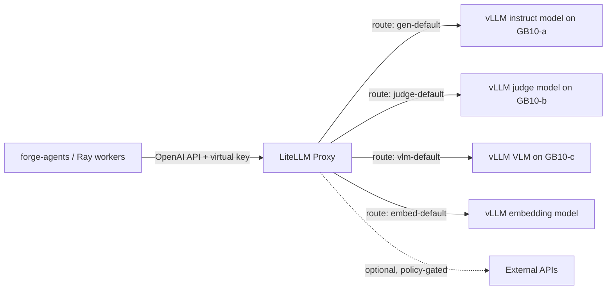

# ARCHITECTURE.md — "Forge": Unified Data Platform for LLM & VLM Training

Status: Draft v1.0 · Owner: Platform Architecture · Target: on-prem k3s on NVIDIA DGX GB10 (ARM64)
Companion docs: [RESEARCH.md](RESEARCH.md), [TASK.md](TASK.md)

## 1. Vision and Scope

### 1.1 Vision
Forge is one platform where a team can build every dataset needed to train an LLM or VLM from scratch. It covers creating, curating, generating, annotating, judging, versioning and exporting four kinds of data:
- pretraining corpora
- SFT/instruction sets
- preference data (DPO/RLHF/KTO)
- multimodal (image+text) data

It runs fully on-prem, and every record is traceable to its sources, transformations, models and humans.

### 1.2 In scope
- **Ingestion.** Sources include web crawl/WARC, files (PDF, HTML, Office, images), HF Hub datasets, S3 buckets and database extracts.
- **Curation.** Covers exact, fuzzy (MinHash-LSH) and semantic dedup; heuristic and model-based quality filters; language ID; PII detection and redaction; toxicity/NSFW filters; token statistics; and data mixing.
- **Synthetic generation.** Task/step DAGs (distilabel-style) executed on LangGraph, with the model in the loop via LiteLLM → vLLM.
- **Agentic workflows.** Deep Agents "dataset builder" and "curation analyst" agents with planning, subagents and a scoped filesystem.
- **Human annotation.** Question types:
  - classification, spans, free text, rating and rubric scoring
  - pairwise/ranking preference and multi-turn chat editing
  - image bbox, polygon and points; VQA; caption editing; image-grounded preference
- **AI feedback.** LLM-as-judge in pointwise, pairwise, rubric and reference-based modes, plus judge calibration against human labels.
- **Versioning.** Immutable dataset versions, lineage and diffs.
- **Export.** Supported formats:
  - HF datasets (Arrow/Parquet), JSONL and Parquet
  - ShareGPT, ChatML/OpenAI messages and Alpaca
  - DPO/KTO pairs and LLaVA-style VLM data
  - Megatron `.bin/.idx` (v2)

### 1.3 Out of scope
- **Model training itself.** Forge exports to TRL, NeMo, Megatron, Axolotl and Unsloth instead.
- **A managed labeling workforce marketplace.**
- **Serving models to end users.** vLLM and LiteLLM are shared infrastructure, and Forge is one tenant of that gateway.

### 1.4 Quality attributes (ranked)
1. **Data integrity and provenance.** Every export must be reproducible from a version ID.
2. **Security and tenant isolation.**
3. **Throughput on limited hardware.** GB10 decode is bandwidth-bound.
4. **Annotator UX latency.** p95 below 150 ms for next-record fetch.
5. **Operability by a small DevOps team.** Use k3s and GitOps, and keep stateful systems few.

### 1.5 Key constraints
- **Architecture.** ARM64 (aarch64) only, so every image must be multi-arch or arm64-native.
- **Hardware.** Each GB10 has 128 GB of unified CPU/GPU memory, an sm_121 GPU, ~273 GB/s memory bandwidth and no MIG.
- **Device plugin.** The NVIDIA k8s-device-plugin must be v0.17.4 or later, because older versions crash when NVML memory queries return "Not Supported" on unified memory.
- **vLLM builds.** vLLM must use CUDA-13 builds (NGC `nvcr.io/nvidia/vllm:26.02-py3`+ or the `vllm/vllm-openai` cu130 track), since CUDA 12.8 builds fail FlashInfer JIT on sm_121.
- **Required stack.** FastAPI, Next.js, LangChain, LangGraph and deepagents.

---

## 2. System Context (C4 Level 1)



## 3. Container Diagram (C4 Level 2)



| Container | Responsibility | Scaling |
|---|---|---|
| forge-web | Next.js UI, server components, BFF (token exchange, no secrets in browser), annotation canvas | HPA on CPU, stateless |
| forge-api | AuthN/Z, domain APIs, SSE/WS fan-out, job submission, record serving | HPA; WS fan-out via Valkey pub/sub |
| forge-agents | LangGraph generation DAGs and deepagents sessions; Postgres checkpointer | KEDA on queue depth |
| forge-worker | Short control jobs: small imports, exports, judge batches, notifications | KEDA on Valkey queue |
| Ray (KubeRay) | Data-parallel curation (dedup, filters, embeddings, token stats), large batch generation | Autoscaler, CPU + optional GPU pool |
| forge-sandbox | Isolated code execution for agents/validators (gVisor or Kata) | Ephemeral per session |
| LiteLLM | Single OpenAI-compatible gateway, virtual keys, budgets, routing, fallbacks | 2+ replicas |
| vLLM | Model serving on GB10 | 1 model per box (or per pair via ConnectX-7) |

---

## 4. Module Breakdown

### 4.1 Ingestion
- **Connectors.** All sources implement the `SourceConnector` plugin interface:
  - WARC/WET files.
  - A polite URL crawler that honours robots.txt and applies per-domain rate limits.
  - S3 prefixes, NFS/SMB drop folders and the HF Hub via an internal mirror.
  - Postgres/MySQL extracts.
  - Image folders with caption sidecars, and COCO/LLaVA JSON.
- **Extraction.**
  - HTML goes through Trafilatura.
  - PDF and Office files go through Unstructured OSS with analytics disabled; `pypdfium2` provides a fast path.
  - Scanned documents are OCR'd by a VLM served on vLLM (v1).
- **Normalization.** Every item becomes a `Record` with three parts:
  - typed `fields` (text, image ref or chat messages)
  - `source` provenance (URL, crawl ID, file hash, license)
  - `metadata`
- **Storage.**
  - Raw blobs go to `s3://forge-{tenant}/raw/…`, content-addressed by SHA-256.
  - Normalized records are stored as Lance datasets.
- **License and consent tagging.** The `license`, `robots_allowed` and `opt_out` fields are set at ingest, and export policies can filter on them.

### 4.2 Curation Pipeline
Operators are composed into **curation recipes** and executed on Ray Data. Operators from DataTrove, NeMo Curator and Data-Juicer (all Apache-2.0) are adapted behind one interface:

```python
class Operator(Protocol):
    name: str; version: str
    kind: Literal["mapper", "filter", "dedup", "tagger", "stats"]
    def process_batch(self, batch: pa.RecordBatch, ctx: OpContext) -> pa.RecordBatch: ...
```

| Stage | Default implementation | Notes |
|---|---|---|
| Language ID | fastText lid.176 / GlotLID; threshold configurable (FineWeb used 0.65) | Adds `lang`, `lang_score` |
| Heuristic quality | Gopher, C4, FineWeb filter families | Every rejection writes `reject_reason` (never a silent drop) |
| Model quality | fastText/DeBERTa "edu"-style classifiers; LLM-judge sampling to train new ones | Classifier training in v1 |
| Exact dedup | SHA-256 of normalized text | Cheap first pass |
| Fuzzy dedup | MinHash-LSH: 5-gram shingles, 14 bands × 8 rows; union-find on Ray actors | Cluster IDs + keep-policy |
| Semantic dedup | vLLM embeddings + k-means + cosine threshold | Mirrors NeMo Curator 26.04 |
| PII | Presidio + regex + optional NER; tag/redact/hash/replace | Redaction map stored encrypted |
| Safety | NSFW/toxicity classifiers, URL blocklists | |
| Image curation | pHash/dHash dedup, CLIP-score alignment, resolution/aspect filters, NSFW classifier, watermark detector | |
| Stats | Token counts per tokenizer, length histograms, language/domain mix | Stored in `dataset_versions.stats` |
| Decontamination | n-gram overlap against registered eval sets | Blocks export if contaminated |

- **Resumability.** Each stage writes Lance fragments plus a `_SUCCESS` manifest, so failed runs resume from the last completed stage.
- **Rejected rows.** Rows that fail a filter go to a `rejected/` side table with their reasons, so they can be explored later.

### 4.3 Synthetic Generation Engine (distilabel-like, on LangGraph)

**Concepts**

| Concept | Role |
|---|---|
| `Pipeline` | The DAG. |
| `Step` | A generic transform. |
| `Task` | An LLM step with a prompt template and an output schema. |
| `GlobalStep` | A step that needs the full batch, such as dedup or clustering. |
| `Validator` | A check written in Python, SQL or as a judge. |

**Compilation.** A versioned YAML/JSON spec compiles to a LangGraph `StateGraph`. Each node processes a batch of rows, and edges support three patterns:
- fan-out, for multiple generators
- fan-in, to combine columns
- conditional routing, for example sending low scores to a rewrite node

**Task library**
- Self-Instruct, Evol-Instruct, Magpie-style prompting and persona-driven generation.
- Multi-turn chat simulation and UltraFeedback-style multi-response rating.
- Rejection sampling with verifiers (sandboxed code execution, math checkers).
- QA/CoT from documents and VLM captioning/VQA.
- Instruction back-translation.

**Runtime**
- **Model access** goes only through LiteLLM with a per-run virtual key. Structured outputs use JSON schema and vLLM guided decoding.
- **Scale path:** batches over ~50k rows are delegated to Ray, using an async client pool whose concurrency is sized from the route's `max_num_seqs`.
- **Caching:** responses are cached by a hash of model, params and prompt. Reruns reuse cached outputs.
- **Durability:** a LangGraph Postgres checkpointer runs per job, with batch-level idempotency keys.



### 4.4 Agentic Workflows (deepagents)

**Dataset Builder Agent** (`create_deep_agent`) turns a natural-language brief into an executable, reviewable plan. An example brief: "5k Vietnamese support SFT dialogs + 2k DPO pairs, PII-free, grounded in these PDFs."

- **Planning.** The agent's plan is persisted as a `PipelineSpec` draft and is **never executed without human approval**. These tools require approval via `interrupt_on`:
  - `submit_pipeline_run`
  - `publish_version`
  - `start_curation_job`
- **Subagents.** Each subagent runs with isolated context.

  | Subagent | Job |
  |---|---|
  | `schema-designer` | Proposes the schema, questions and rubric. |
  | `prompt-engineer` | Drafts prompts and runs 20-row previews. |
  | `quality-analyst` | Reads stats and judge reports, then proposes thresholds. |
  | `curation-planner` | Composes recipes from the operator catalog. |
  | Deterministic subagent | A compiled `CompiledStateGraph` for fixed pipelines. |

- **Filesystem.** A composite backend exposes three prefixes:
  - `/workspace/` is a LangGraph Store namespace keyed by `(tenant_id, session_id)`.
  - `/samples/` is a read-only view of sampled records.
  - `/specs/` holds pipeline YAML.

  `FilesystemPermission` denies everything else, and there is no local-disk backend in production.
- **Tools.** Tools are the only way an agent touches the platform. Each is a typed, tenant-bound FastAPI call made with the user's delegated, down-scoped token.
  - `list_datasets`, `sample_records`, `get_stats`, `list_operators`
  - `validate_pipeline_spec`, `preview_pipeline` (n ≤ 50), `submit_pipeline_run` (requires human approval)
  - `create_annotation_queue`, `run_judge_preview`, `search_docs`

  There is **no SQL tool, no raw HTTP tool, and no shell outside the sandbox.**
- **Curation Analyst Agent.** Explores rejected and accepted slices, clusters them with embeddings plus LLM titling, and writes `/workspace/report.md`.
- **Budgets.** Each session gets a LiteLLM virtual key with USD/token budgets and RPM caps, and aborts gracefully when they are exhausted.
- **Security posture.** deepagents "trusts the LLM," so enforcement lives in the tools (authZ, row limits, allow-listed operators) and in the sandbox (gVisor/Kata with no egress except to LiteLLM).

### 4.5 Annotation Workspace (Next.js)

**Question types**
- Text: label (single or multi), span/NER, free text, Likert rating and multi-criterion rubric.
- Preference: drag-to-rank, pairwise (with tie/both-bad and a rationale) and KTO thumbs.
- Chat: a chat-turn editor for producing gold SFT data.
- Image: bbox, polygon, keypoints, VQA (optionally region-grounded), caption editing and image-grounded pairwise.

**Rendering.** A component registry renders markdown, code, LaTeX, chat transcripts and zoomable images. The canvas uses Konva, and the UI is keyboard-first.

**Suggestions.** Model and judge suggestions pre-fill answers with visible provenance. Both the suggestion and the final response are stored.

**Queues.** An `AnnotationQueue` supports round-robin, overlap-k, active-learning priority and stratified strategies. Records are leased with `SELECT … FOR UPDATE SKIP LOCKED` and a TTL.

**Quality controls**
- Gold/honeypot items.
- Agreement metrics: Krippendorff's α and Cohen's κ.
- Reviewer adjudication and annotator dashboards.
- Confident-learning label-issue scores (v1).

**Real-time updates.** WebSocket carries presence and lease heartbeats; SSE carries progress counters.

**i18n.** RTL support and CJK/Vietnamese font fallback.

### 4.6 LLM-as-Judge / AI Feedback
- **Types:**
  - pointwise rubric (1–10 with anchors)
  - pairwise with position swap to cancel order bias
  - reference-based, checklist and VLM judges
  - programmatic verifiers
- **Registry:** each `JudgeDefinition` holds a prompt, rubric, model route, parse schema and version.
- **Calibration:** every judge is evaluated against a human-labeled set (accuracy, κ, Spearman). Judges below threshold cannot gate exports.
- **Ensembles:** majority or mean across 2–3 judge models. Disagreements are routed to a human queue.
- **Outputs:** `JudgeScore` rows are never overwritten.

### 4.7 Dataset Versioning
- **Git-like model.** Each dataset has a mutable **draft** and immutable **versions**. A version is a Lance native version plus a Postgres row holding parents, author, run ID, recipe hash, stats and manifest hash.
- **Lineage.** `lineage_edges` link version ← run ← inputs, and a per-record append-only `provenance` column tracks each record's history.
- **Diffs and branching.**
  - Row-level diffs with a sample diff viewer.
  - Branches such as `main` and `exp/*`.
  - A merge creates a two-parent version.
- **Retention.** Tagged versions are immutable, and untagged drafts are garbage-collected by policy.

### 4.8 Export
- **Formats:**
  - HF datasets (Parquet shards + `dataset_info`, pushed to an internal Hub/registry), JSONL and Parquet
  - ShareGPT, ChatML/OpenAI `messages` and Alpaca
  - DPO (`prompt, chosen, rejected`) and KTO
  - LLaVA-style VLM data and WebDataset (v1)
  - Megatron `.bin/.idx` (v2)
- **Policies:** exports can be gated on license filters, PII-clean status, decontamination and judge calibration. A violation blocks the export and reports the reasons.
- **Reproducibility:** every export writes an `export_manifest.json` recording version ID, format, filters, template, tokenizer and hashes.
- **Chat templating:** a chat template can optionally be pre-applied using the target model's tokenizer.

---

## 5. Data Model and Schema

### 5.1 Core entities (Postgres)



```sql
CREATE TABLE tenants (id uuid PRIMARY KEY, slug text UNIQUE, litellm_team_id text, created_at timestamptz);
CREATE TABLE workspaces (id uuid PRIMARY KEY, tenant_id uuid NOT NULL REFERENCES tenants, name text);
CREATE TABLE datasets (
  id uuid PRIMARY KEY, tenant_id uuid NOT NULL, workspace_id uuid NOT NULL,
  name text, kind text CHECK (kind IN ('pretrain','sft','preference','vlm','eval','generic')),
  lance_uri text NOT NULL, draft_lance_version bigint, created_by uuid);
CREATE TABLE dataset_versions (
  id uuid PRIMARY KEY, tenant_id uuid NOT NULL, dataset_id uuid NOT NULL,
  lance_version bigint NOT NULL, parent_ids uuid[], tag text, message text,
  run_id uuid, manifest_sha256 text, stats jsonb, created_by uuid, created_at timestamptz,
  UNIQUE (dataset_id, tag));
CREATE TABLE field_defs (id uuid PRIMARY KEY, dataset_id uuid, name text,
  type text CHECK (type IN ('text','markdown','chat','image','image_list','json','custom')), required bool);
CREATE TABLE question_defs (id uuid PRIMARY KEY, dataset_id uuid, name text,
  type text CHECK (type IN ('label','multi_label','span','text','rating','rubric','ranking',
                            'pairwise','kto','chat_edit','bbox','polygon','keypoints','vqa','caption')),
  settings jsonb, required bool);
CREATE TABLE responses (id uuid PRIMARY KEY, tenant_id uuid NOT NULL, dataset_id uuid,
  record_id text NOT NULL, question_id uuid, user_id uuid, value jsonb,
  status text CHECK (status IN ('draft','submitted','discarded')), time_spent_ms int,
  created_at timestamptz, UNIQUE (record_id, question_id, user_id));
CREATE TABLE suggestions (id uuid PRIMARY KEY, tenant_id uuid, record_id text, question_id uuid,
  value jsonb, score real, agent text, model_route text, created_at timestamptz);
CREATE TABLE judge_scores (id uuid PRIMARY KEY, tenant_id uuid, record_id text, judge_def_id uuid,
  judge_version int, scores jsonb, rationale text, model_route text, created_at timestamptz);
CREATE TABLE pipeline_runs (id uuid PRIMARY KEY, tenant_id uuid, pipeline_id uuid, spec_sha256 text,
  status text, engine text CHECK (engine IN ('langgraph','ray','hybrid')),
  input_version_ids uuid[], output_dataset_id uuid, cost_usd numeric, tokens bigint,
  started_at timestamptz, finished_at timestamptz);
CREATE TABLE audit_events (id bigserial PRIMARY KEY, tenant_id uuid, actor text, action text,
  resource text, details jsonb, at timestamptz DEFAULT now());
-- Every tenant-scoped table:
-- ALTER TABLE … ENABLE ROW LEVEL SECURITY;
-- CREATE POLICY tenant_isolation ON … USING (tenant_id = current_setting('forge.tenant_id')::uuid);
```

### 5.2 Record schema (Lance / Arrow)

| Column | Type | Notes |
|---|---|---|
| `record_id` | string (ULID) | Stable across versions |
| `fields` | struct per dataset schema | `text`, `messages: list<struct<role,content>>`, `image: struct<uri,sha256,width,height>` |
| `metadata` | map + typed columns | domain, source, license |
| `provenance` | list<struct<op, op_version, run_id, model_route, at>> | Append-only |
| `quality` | struct | lang, scores, pii_flags, dup_cluster_id |
| `status` | enum | pending / accepted / rejected / needs_review |
| `reject_reason` | string | Nullable |
| `embedding` | fixed_size_list<float, d> | Optional; Lance vector index |

Images are stored once, content-addressed, and referenced by URI. Thumbnails are pre-generated for the annotation UI.

---

## 6. API Design (FastAPI)

### 6.1 Principles
- **Intent-named endpoints only.** No generic `/tables/{name}` CRUD, no "execute query" endpoint, and no passthrough to Postgres, S3 or LiteLLM.
- **Tenant comes from the token, never from the path or body.** The service layer checks ownership, and Postgres RLS enforces it again.
- **Versioned and typed.** Endpoints live under `/v1`; OpenAPI generates a typed TS client via `openapi-typescript`.
- **Long operations** return `202 Accepted` with a `run_id`, and progress streams over SSE.
- **POSTs that create runs or exports** require an `Idempotency-Key` header.
- **Paging and limits.** Pagination is cursor-based with a max page size. Bulk calls are capped at 10k records; anything larger goes through an import job.

### 6.2 Endpoint catalogue

| Method & path | Purpose | Min role |
|---|---|---|
| `GET /v1/me` | Profile, tenant, roles | any |
| `POST /v1/workspaces/{ws}/datasets` | Create dataset with schema | curator |
| `POST /v1/datasets/{id}/imports` | Start import job | curator |
| `POST /v1/datasets/{id}/records:bulk` | Add ≤10k records to draft | curator |
| `POST /v1/datasets/{id}/records:search` | Filter/semantic search via structured DSL (no raw SQL) | viewer |
| `POST /v1/datasets/{id}/versions` | Commit draft → version | curator |
| `GET /v1/datasets/{id}/versions/{v}/diff?against=` | Diff | viewer |
| `POST /v1/curation-recipes`, `POST /v1/curation-recipes/{id}/runs` | Define / run curation | curator |
| `POST /v1/pipelines`, `POST /v1/pipelines/{id}:preview`, `POST /v1/pipelines/{id}/runs` | Generation DAGs | curator |
| `GET /v1/runs/{run_id}`, `GET /v1/runs/{run_id}/events` (SSE) | Status & progress | viewer |
| `POST /v1/runs/{run_id}:cancel` | Cancel | curator |
| `POST /v1/judges`, `POST /v1/judges/{id}:calibrate` | Judges & calibration | curator |
| `POST /v1/datasets/{id}/queues` | Create annotation queue | lead |
| `POST /v1/queues/{q}/assignments:next` | Lease next record(s) | annotator |
| `PUT /v1/assignments/{a}/response` | Save/submit response | annotator |
| `GET /v1/queues/{q}/metrics` | Progress, IAA, throughput | lead |
| `WS /v1/ws/annotation` | Presence, lease heartbeat | annotator |
| `POST /v1/agent-sessions`, `POST /v1/agent-sessions/{s}/messages` (SSE) | Dataset builder agent | curator |
| `POST /v1/agent-sessions/{s}/approvals/{interrupt_id}` | Approve/reject HITL interrupt | curator |
| `POST /v1/versions/{v}/exports`, `GET /v1/exports/{e}` | Export & pre-signed download | curator |
| `GET /v1/model-routes` | Models allowed for tenant | viewer |
| `GET /v1/audit-events` | Audit log | admin |

### 6.3 Streaming
- **SSE** carries run progress and agent streams, mapped from LangGraph `stream_mode=["updates","messages","custom"]`. Streams are resumable via `Last-Event-ID`, backed by a Valkey stream per run.
- **WebSocket** is used only for annotation presence and leases. Clients authenticate with a short-lived ticket from REST, so no tokens appear in query strings.

---

## 7. Job Orchestration and Queues

### 7.1 Workload classes

| Class | Examples | Duration | Engine |
|---|---|---|---|
| Interactive | Record fetch, previews ≤ 50 rows | < 2 s | API process |
| Control jobs | Small imports, exports, judge batches ≤ 50k | sec–min | Arq on Valkey |
| Agent/DAG runs | LangGraph pipelines, deepagents sessions | min–hours, HITL pauses | LangGraph + Postgres checkpointer |
| Data-parallel | Dedup, filters, embeddings, 1M+ generation | hours–days | Ray (KubeRay) |

### 7.2 Trade-offs

| Option | Pros | Cons | Verdict |
|---|---|---|---|
| Celery | Mature | Sync-first; weak workflow durability | Rejected |
| Arq | Native async, small, fits FastAPI, ARM64-friendly | Limited workflow semantics | **Control jobs** |
| Ray (KubeRay) | Data-parallel, GPU scheduling; Curator/Data-Juicer are Ray-native | Ops complexity; head SPOF (use GCS FT) | **Data plane** |
| Temporal | Best-in-class durable workflows | Another stateful cluster; overlaps LangGraph | Deferred to v2 |
| LangGraph checkpointer | Durable, HITL-native | Not a general scheduler | **Agent/DAG durability** |

### 7.3 Run lifecycle

Runs move through `queued → running → (waiting_approval) → succeeded | failed | cancelled`. State is persisted in `pipeline_runs` and emitted to a Valkey stream, which feeds SSE.

- **Retries.** Each step retries with exponential backoff, and poison batches are quarantined.
- **Quotas.** Each tenant has a run quota.
- **Model concurrency.** Each model route has a Valkey semaphore sized to vLLM's `max_num_seqs`.

---

## 8. Storage

| Store | Tech | Holds | Why |
|---|---|---|---|
| Relational | PostgreSQL 16 (CloudNativePG, arm64) | Tenancy, schema, responses, runs, judges, audit, LangGraph checkpoints/store | ACID, RLS, JSONB; one DB to operate |
| Vector (MVP) | pgvector (HNSW) | ≤ ~10M embeddings for UI search | No extra system |
| Vector (scale) | Lance vector index | 10M+ embeddings for dedup/clustering | Colocated with data |
| Records | Lance on S3 | Records, versions, multimodal refs | Random access + native versions + vectors |
| Interchange | Parquet | Exports, HF shards | Ecosystem standard |
| Objects | S3-compatible (MinIO, SeaweedFS or Ceph RGW) | Raw blobs, images, Lance, exports, caches | See ADR-006 |
| Cache/queue | Valkey | Arq queues, SSE streams, rate limits | BSD-licensed Redis fork |

Each tenant gets its own bucket (`forge-{tenant}`) with encryption at rest and scoped service accounts. The browser only receives pre-signed GET URLs that expire within 15 minutes.

---

## 9. Model Gateway: LiteLLM → vLLM



- **Virtual keys.** Each tenant is one LiteLLM team, and each run or agent session gets its own key with budget, RPM/TPM and a model allow-list. forge-api mints keys through the LiteLLM admin API, using a credential stored only in the secrets manager, and revokes them when the run ends.
- **Logical routes.** Pipelines reference routes such as `gen-default`, `judge-strong` and `vlm-default` rather than model names, so admins can remap models without changing specs. Route metadata is exposed via `GET /v1/model-routes`: context length, `max_num_seqs`, vision support and guided-JSON support.
- **vLLM on GB10:**
  - Use CUDA-13 builds pinned by digest.
  - Set `--gpu-memory-utilization` to about 0.80–0.85 on shared nodes (higher only on dedicated nodes).
  - Prefer quantized MoE models (NVFP4/FP8), because decode is bandwidth-bound.
  - Keep `--max-num-seqs` modest for interactive routes and raise it for offline batch routes.
  - Enable prefix caching.
  - Two boxes linked over ConnectX-7 can serve one model with TP=2.
- **Guided decoding.** JSON-schema outputs eliminate parse failures in Tasks and Judges.
- **Offline mode.** For jobs over 1M rows, a Ray job may run the vLLM `LLM` engine directly on a dedicated node. It is still registered as a route for accounting.
- **LiteLLM images.** Use `ghcr.io/berriai/litellm` (multi-arch) pinned by digest, and smoke-test each upgrade on arm64.
- **Resilience.** Fallbacks, retries and circuit breaking are configured in LiteLLM, and requests are logged to Langfuse with PII redaction.

---

## 10. Multi-tenancy, AuthN and AuthZ

- **Identity.**
  - Keycloak (arm64) federates corporate SSO over SAML, OIDC or LDAP.
  - Next.js uses Authorization Code + PKCE via the BFF.
  - Tokens are held server-side in encrypted HttpOnly cookies.
- **Token-bound tenancy.**
  - Access tokens carry `tenant_id`, `workspace_roles` and `sub`.
  - The FastAPI `get_principal()` dependency validates the token and sets `SET LOCAL forge.tenant_id`, so RLS enforces isolation even if a query omits a filter.
  - Service-to-service calls use Kubernetes projected tokens plus OAuth token exchange.
  - Agents act on behalf of the user with down-scoped tokens.
- **RBAC roles per workspace:**

  | Role | Access |
  |---|---|
  | `owner`, `admin` | Full workspace administration. |
  | `curator` | Datasets, pipelines and exports. |
  | `lead` | Queues and adjudication. |
  | `annotator` | Assigned queues only. |
  | `viewer` | Read-only. |
  | `auditor` | Audit log and lineage. |

  Permissions are evaluated by Cerbos or an OPA sidecar, and every decision is logged.
- **Sensitivity labels.** Datasets are labelled `public`, `internal` or `restricted-pii`. Restricted datasets block external model routes and require PII redaction before external annotators see them.
- **Isolation tiers.**
  - Default: a shared cluster with RLS, per-tenant buckets and a per-tenant LiteLLM team.
  - High sensitivity: a dedicated namespace, database and vLLM routes.

---

## 11. Observability

- **Tracing.** The OTel SDK is installed in FastAPI, Arq, Ray tasks (context propagated via job metadata) and the Next.js server. Data flows to the OTel Collector, then Tempo, Loki and Prometheus/Grafana. Metrics come from vLLM, LiteLLM, the Ray dashboard and DCGM.
- **LLM tracing.** Self-hosted Langfuse is the default sink for LangChain, LangGraph, deepagents and LiteLLM callbacks. It records prompts, completions, tokens, cost and latency per run, session and tenant. LangSmith is pluggable via `TRACING_BACKEND`, but on-prem use needs an enterprise license.
- **Data-quality dashboards.** Per-version token counts, language mix, rejection reasons, dup rates, judge-score distributions and IAA trends.
- **SLOs:**

  | Metric | Target |
  |---|---|
  | API p95 (non-streaming) | < 300 ms |
  | Next-record p95 | < 150 ms |
  | Run-status freshness | < 5 s |
  | Gateway error rate | < 1% |

- **Privacy.** Payloads are redacted before trace export, and each tenant sets its own retention.

---

## 12. Scalability and Kubernetes (k3s on ARM64)

### 12.1 Example topology (4× GB10)

| Node | Label | Workloads |
|---|---|---|
| gb10-01 | `forge/role=control` | k3s server, Postgres primary, Valkey, Keycloak, LiteLLM, forge-api/web |
| gb10-02 | `forge/role=serve` | vLLM generator route |
| gb10-03 | `forge/role=serve` | vLLM judge/VLM routes |
| gb10-04 | `forge/role=batch` | Ray workers, offline vLLM, embeddings |

k3s HA needs 3 server nodes (embedded etcd). To scale out, add GB10 nodes or x86 CPU nodes for Ray CPU pools (which requires multi-arch images).

### 12.2 GPU enablement
- **Device plugin.** Run the GPU Operator with device plugin v0.17.4 or later.
- **No MIG.** Run one vLLM pod per GPU, and use time-slicing only for small embedding or classifier pods.
- **Unified memory.** Set memory requests and limits on vLLM pods to cover weights plus KV cache. Taint serving nodes (`forge/serve=true:NoSchedule`) so Ray tasks don't starve vLLM.
- **Install method.** Install k3s natively on DGX OS (cgroup v2); nested k3s-in-Docker fails on GB10.

### 12.3 Delivery
- **GitOps.** Argo CD (or Flux) with Helm charts.
- **Supply chain.**
  - Images are built multi-arch via `buildx`, with `linux/arm64` required.
  - They are signed with cosign, get SBOMs from Syft and are scanned with Trivy.
  - Kyverno verifies signatures and digest pins.
- **Air-gap.** A private registry mirror (Harbor or k3s `registries.yaml`).
- **Autoscaling.** HPA for api/web, KEDA for Arq and agent backlogs, and the KubeRay autoscaler.
- **Backups.** CloudNativePG WAL archiving to object storage, bucket versioning and Velero.

---

## 13. Security

### 13.1 Guardrails against common anti-patterns (non-negotiable)

| Anti-pattern | Guardrail |
|---|---|
| Generic CRUD / query passthrough APIs | Intent-named endpoints only; server-compiled filter DSL with allow-listed fields; CI lint rejects table-generic handlers; no DB/S3/LiteLLM admin endpoints reachable from the browser |
| Privileged containers | Pod Security Admission `restricted`; `runAsNonRoot`, read-only rootfs, drop ALL caps, seccomp `RuntimeDefault`; GPU via device plugin only. Community GB10 vLLM images that use `--privileged` are rejected |
| Secrets in env files/images/Git | OpenBao/Vault + External Secrets Operator; short-lived DB creds; LiteLLM master key only in forge-api's secret; gitleaks in CI |
| Tenant from request body/path | Tenant from token claims only; RLS defense-in-depth; per-tenant buckets and LiteLLM teams; cross-tenant tests in CI |
| Agent with unbounded tools | Typed scoped tools; deny-by-default `FilesystemPermission`; HITL on side-effecting tools; egress-denied sandbox; per-session budgets |
| Long-lived broad API keys | Per-run virtual keys with TTL + budget; scoped, expiring personal tokens |

### 13.2 Additional controls
- **Network.** NetworkPolicies are default-deny. Only forge services may reach LiteLLM, only LiteLLM may reach vLLM, and the sandbox has no egress.
- **In-cluster mTLS.** Linkerd.
- **Prompt-injection defenses.**
  - Ingested content is data, never instructions, and is wrapped in delimited blocks.
  - Tools refuse actions that content requests.
  - Judge outputs are schema-validated.
- **Supply chain.**
  - Pinned digests, signed images and dependency scanning.
  - Library telemetry disabled: `NEMO_TELEMETRY_ENABLED=false`, Unstructured analytics off, `HF_HUB_DISABLE_TELEMETRY=1`, `DO_NOT_TRACK=1`.
- **Audit.** `audit_events` is append-only and also shipped to Loki/SIEM. Exports, publishes, role changes, approvals and agent tool calls are all logged.
- **Data protection.**
  - Encryption at rest and TLS 1.3 at ingress.
  - PII redaction maps are encrypted with per-tenant keys.
- **Licensing.** License tags propagate through lineage, and export policy enforces the allowed licenses.

---

## 14. Architecture Decision Records

**ADR-001 — Build a platform layer over existing engines; don't fork Argilla.**
- *Context:* Argilla is maintenance-only and built on Vue + Elasticsearch.
- *Decision:* Start a new Next.js/FastAPI codebase that adopts Argilla's field/question/suggestion/response concepts.
- *Consequences:* More UI work, a clean stack and no Elasticsearch dependency.

**ADR-002 — LangGraph for generation DAGs; Ray for heavy batch.**
- *Decision:* Compile specs to StateGraphs with batch nodes, and offload work over 50k rows to Ray.
- *Consequences:* Two execution paths to test, but one unified spec.

**ADR-003 — Deep Agents plan; they never execute.**
- *Decision:* Agents produce specs and previews. Execution needs human approval and runs on deterministic engines.
- *Consequences:* Runs are safe and reproducible.

**ADR-004 — Lance as the record store; Parquet for exports.**
- *Decision:* Lance (random access, native versions, vector index) plus Postgres metadata.
- *Alternatives:* Delta/Iceberg (weaker random access) and lakeFS (an extra service).

**ADR-005 — Postgres + pgvector first; no standalone vector DB in the MVP.**
- *Decision:* Revisit Qdrant or Milvus only above ~50M interactive vectors per tenant.

**ADR-006 — Code against the S3 AP chooses the vendor.**
- *Context:* MinIO's community edition is AGPLv3 and its distribution model changed in 2025 (verify before adopting). SeaweedFS (Apache-2.0) and Ceph RGW are alternatives.
- *Decision:* Validate the chosen store on arm64 during the MVP.

**ADR-007 — Arq + Ray; Temporal deferred.**
- *Decision:* See §7.2. Revisit when cross-system sagas appear.

**ADR-008 — LiteLLM is the only model egress, with per-run virtual keys and logical routes.**
- *Consequences:* Budgets, audit and model  are centralized. LiteLLM becomes critical, so it runs 2+ replicas with an HA DB.

**ADR-009 — Langfuse (self-hosted) for LLM tracing; OTel for everything else.**
- *Context:* On-prem sovereignty matters, and LangSmith self-hosting needs an enterprise license.

**ADR-010 — Keycloak OIDC + token-bound tenancy + Postgres RLS + policy engine.**
- *Consequences:* Defense-in-depth, at the cost of small per-request overhead.

**ADR-011 — ARM64-first, multi-arch images, no privileged pods.**
- *Consequences:ileged community images are rejected, and we maintain a hardened vLLM base if NGC lags.

**ADR-012 — Reuse DataTrove / NeMo Curator / Data-Juicer operators via adapters.**
- *Consequences:* Fast feature coverage, but we must pin upstream versions, run contract tests and track license notices.
