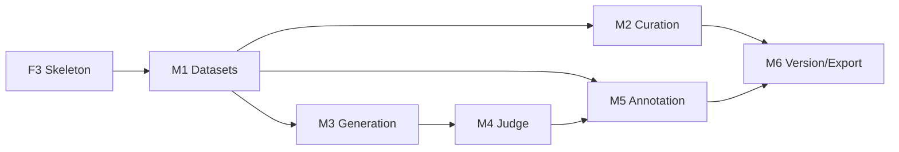

# Phase 1 (MVP) Implementation Plan

Status: Draft · Target: Weeks 5–14 · Est: ~35 engineer-weeks

Companion docs: [Architecture](architecture.md), [Tasks](tasks.md), [Phase 0](phase-0.md)

---

## Overview

Phase 1 delivers the minimum viable product for the Forge platform. This phase implements the core data platform functionality: importing, curating, generating, annotating, versioning, and exporting datasets for LLM/VLM training.

### Definition of Done

A feature is done when all of the following hold:
- Code reviewed with unit and integration tests
- OpenAPI spec updated and docs updated
- Runs on arm64 k3s staging with no privileged pods
- Secrets come via External Secrets Operator
- OTel spans present
- Tenant-isolation test covers new data-access paths

---

## Milestones

| Milestone | Target | Exit criteria |
|---|---|---|
| **M1.0** | Week 7 | Datasets, schema, records, and imports working |
| **M1.1** | Week 9 | Curation pipeline (lang ID, filters, dedup, PII) complete |
| **M1.2** | Week 11 | Generation engine (LangGraph) and judges working |
| **M1.3** | Week 13 | Annotation UI and versioning/export working |
| **M1 Demo** | Week 14 | End-to-end pipeline from import to export |

---

## EPIC M1: Datasets, schema and records (5 ew)

### M1.1 Dataset endpoints (1.5 ew)

**Tasks:**
- Implement dataset CRUD endpoints (`/v1/workspaces/{ws}/datasets`)
- Implement schema definition with field and question types
- Validate schema settings via OpenAPI schema
- Implement dataset kind enum (pretrain, sft, preference, vlm, eval, generic)

**Acceptance criteria:**
- Create dataset with valid schema → `201 Created`
- Invalid schema settings → `422 Unprocessable Entity` with problem+json
- List datasets per workspace returns sorted, paginated results
- Get dataset returns full schema with field and question definitions

**Test plan:**
- Unit: schema validation, dataset creation, listing
- Integration: POST dataset → GET dataset → PATCH schema
- Tenant isolation: tenant A cannot see tenant B's datasets

**Files:**
```
src/api/app/v1/endpoints/datasets.py
src/api/app/v1/schemas/dataset.py
src/models/dataset.py
src/models/schema.py
tests/unit/test_dataset.py
tests/integration/test_datasets.py
```

---

### M1.2 Lance record store (2 ew)

**Tasks:**
- Implement `RecordStore` interface with Lance backend
- Implement bulk add (≤10k records), get by ID, cursor-based scan
- Implement structured filter DSL (no raw SQL)
- Implement search with vector index (pgvector for MVP)

**Acceptance criteria:**
- 1M-record dataset next-page p95 < 200 ms
- DSL fuzz test proves no arbitrary SQL
- Record IDs are ULIDs, stable across versions
- Metadata stored as JSONB for filtering

**Implementation notes:**
```python
# Filter DSL examples:
# {"field": "lang", "op": "==", "value": "en"}
# {"field": "quality_score", "op": ">", "value": 0.5}
# {"field": "tags", "op": "contains", "value": "news"}
# {"field": "embedding", "op": "nearest", "vector": [...], "k": 10}
```

**Test plan:**
- Performance: 1M records, cursor pagination p95 < 200 ms
- DSL: fuzz test with 1000 random filters, verify no SQL injection
- Tenant isolation: cross-tenant record access blocked

**Files:**
```
src/api/app/core/record_store.py
src/api/app/v1/endpoints/records.py
src/api/app/v1/schemas/record.py
src/models/record.py
tests/unit/test_record_store.py
tests/integration/test_records.py
```

---

### M1.3 Import jobs (1.5 ew)

**Tasks:**
- Implement Arq workers for import jobs
- Implement connectors: JSONL, Parquet, CSV, HF mirror, S3 prefix
- Implement SSE progress updates
- Implement resumable imports (checkpointing)

**Acceptance criteria:**
- 500k-row import with SSE progress
- Worker kill during import → resume from checkpoint
- Import job returns `202 Accepted` with `run_id`
- Progress streamed over SSE to `/v1/runs/{run_id}/events`

**Implementation notes:**
```python
# Import job flow:
# 1. POST /v1/datasets/{id}/imports → 202 Accepted with run_id
# 2. Arq worker processes batches
# 3. SSE: {"event": "progress", "data": {"rows": 50000, "total": 500000}}
# 4. On completion: SSE {"event": "completed", "data": {"records": 500000}}
```

**Test plan:**
- Import 500k rows, verify all records in Lance
- Kill worker mid-import, verify resume works
- Import invalid format → `422` with error message

**Files:**
```
src/api/app/jobs/import_job.py
src/api/app/v1/endpoints/jobs.py
src/api/app/v1/schemas/job.py
src/models/import_job.py
tests/unit/test_import_job.py
tests/integration/test_import.py
```

---

## EPIC M2: Curation MVP (6 ew)

### M2.1 Operator interface (2 ew)

**Tasks:**
- Implement `Operator` protocol (mapper, filter, dedup, tagger, stats)
- Implement DataTrove filter adapters (Gopher, C4, FineWeb families)
- Implement fastText lang ID / GlotLID integration
- Implement operator registry with versioning

**Acceptance criteria:**
- Every rejected row has `reject_reason` field
- Per-stage stats written to `dataset_versions.stats`
- Operator registry supports `list_operators()`, `get_operator(name, version)`
- Invalid operator config → `422` with error details

**Operator interface:**
```python
class Operator(Protocol):
    name: str
    version: str
    kind: Literal["mapper", "filter", "dedup", "tagger", "stats"]
    
    def process_batch(
        self, batch: pa.RecordBatch, ctx: OpContext
    ) -> pa.RecordBatch:
        """Process a batch, return transformed batch."""
```

**Test plan:**
- Apply filter operator to 100k rows, verify rejections have reasons
- Apply mapper operator, verify columns added
- Registry returns correct version for `name`+`version` pair

**Files:**
```
src/api/app/core/curation/operator.py
src/api/app/core/curation/registry.py
src/api/app/core/curation/adapters/datatrove.py
src/api/app/v1/endpoints/curation.py
src/models/curation.py
tests/unit/test_operators.py
tests/integration/test_curation.py
```

---

### M2.2 Exact + MinHash dedup (2 ew)

**Tasks:**
- Implement SHA-256 exact dedup on normalized text
- Implement MinHash-LSH (5-gram shingles, 14×8 default)
- Implement union-find clustering on Ray actors
- Implement dedup results storage (cluster IDs)

**Acceptance criteria:**
- On 10M-doc sample, recall ≥ 0.9 vs brute-force Jaccard ≥ 0.8 on labeled subset
- Cluster IDs stored in `dup_cluster_id` field
- Resumable: kill + resume yields identical cluster IDs

**Implementation notes:**
```python
# MinHash params (configurable):
# - n_bands: 14
# - n_rows_per_band: 8
# - ngram_size: 5
# - jaccard_threshold: 0.8
```

**Test plan:**
- On 1M-row synthetic dataset with known duplicates, verify recall ≥ 0.9
- On 10M-row production-like dataset, verify cluster IDs stable across runs
- Kill Ray worker mid-dedup, verify resume produces same clusters

**Files:**
```
src/api/app/core/curation/dedup.py
src/api/app/core/curation/minhash.py
src/api/app/jobs/dedup_job.py
tests/unit/test_dedup.py
tests/integration/test_dedup.py
```

---

### M2.3 PII operator (1 ew)

**Tasks:**
- Implement Presidio + regex-based PII detection
- Implement redaction modes: tag, hash, replace, redact
- Implement encrypted redaction map storage

**Acceptance criteria:**
- ≥98% of seeded emails/IPs/phones redacted
- Redaction map encrypted with tenant key
- PII flags stored in `pii_flags` field
- Redacted value stored in `pii_redacted_text` field

**Test plan:**
- Seed dataset with 100 known PII instances, verify ≥98% detected
- Redaction map encrypted at rest
- Cross-tenant redaction maps isolated

**Files:**
```
src/api/app/core/curation/pii.py
src/models/pii_redaction.py
tests/unit/test_pii.py
tests/integration/test_pii.py
```

---

### M2.4 Token stats (1 ew)

**Tasks:**
- Implement tokenizer-aware token counting
- Implement configurable tokenizer (configurable via schema)
- Implement length histograms
- Implement resumable stage manifests

**Acceptance criteria:**
- Kill + resume yields identical output hash
- Stats stored in `dataset_versions.stats.tokenization`
- Length histograms with 100 buckets, 0–512k tokens

**Test plan:**
- On 100k rows, verify token counts match manual count
- Resume after kill produces identical hash
- Stats accessible via `/v1/datasets/{id}/versions/{v}/stats`

**Files:**
```
src/api/app/core/curation/stats.py
src/models/stats.py
tests/unit/test_token_stats.py
```

---

## EPIC M3: Generation engine MVP (6 ew)

### M3.1 Pipeline compiler (2 ew)

**Tasks:**
- Implement Pipeline spec schema (YAML/JSON)
- Implement LangGraph `StateGraph` compiler
- Implement Step/Task/Combine/Validator nodes
- Implement Postgres checkpointer for durability

**Acceptance criteria:**
- Invalid DAG (cycle, missing column) rejected at validation
- Compilation produces valid LangGraph
- Checkpointer persists state per batch

**Pipeline spec example:**
```yaml
name: self_instruct
version: "1.0"
steps:
  - name: seed_loader
    type: loader
    config: {path: "s3://bucket/seeds.jsonl"}
  - name: generate_instruction
    type: task
    config: {prompt_template: "...", model_route: "gen-default"}
  - name: combine
    type: combine
    config: {columns: ["instruction", "response"]}
```

**Test plan:**
- Cycle detection: DAG with cycle → validation error
- Missing column: step references non-existent column → validation error
- Valid DAG compiles to LangGraph without errors

**Files:**
```
src/api/app/core/pipeline/spec.py
src/api/app/core/pipeline/compiler.py
src/api/app/core/pipeline/checkpointer.py
src/api/app/v1/endpoints/pipelines.py
src/models/pipeline.py
tests/unit/test_pipeline_compiler.py
tests/integration/test_pipeline.py
```

---

### M3.2 Task library (1.5 ew)

**Tasks:**
- Implement task templates: self-instruct, evol-instruct
- Implement multi-response (model A/B)
- Implement QA-from-document
- Implement chat simulation
- Implement golden snapshot tests with mock LLM

**Acceptance criteria:**
- All task templates produce valid outputs
- Golden snapshot tests pass with mock LLM
- Response schema validated against output schema

**Test plan:**
- For each task template, generate 20 rows with mock LLM
- Compare output to golden snapshot (SHA-256 match)
- Validate schema compliance

**Files:**
```
src/api/app/core/pipeline/tasks/self_instruct.py
src/api/app/core/pipeline/tasks/evol_instruct.py
src/api/app/core/pipeline/tasks/multi_response.py
src/api/app/core/pipeline/tasks/qa_from_document.py
src/api/app/core/pipeline/tasks/chat_simulation.py
tests/unit/test_tasks.py
```

---

### M3.3 LiteLLM client (1.5 ew)

**Tasks:**
- Implement per-run key minting via LiteLLM API
- Implement per-run key revocation
- Implement route semaphores (vLLM `max_num_seqs`-based)
- Implement response caching
- Implement guided JSON (JSON schema → vLLM guided decoding)

**Acceptance criteria:**
- Unchanged rerun makes zero LLM calls (cache hit)
- Budget exhaustion → `failed: budget_exceeded`
- Guided JSON produces valid structured output

**Implementation notes:**
```python
# Per-run key flow:
# 1. Start run → mint virtual key via LiteLLM admin API
# 2. Run tasks using virtual key
# 3. End run → revoke virtual key
```

**Test plan:**
- Rerun identical pipeline → cache hit (zero LLM calls)
- Exhaust budget → `429 Too Many Requests` → job fails with `budget_exceeded`
- Guided JSON schema → valid structured output

**Files:**
```
src/api/app/core/llm/litellm_client.py
src/api/app/core/llm/route_semaphore.py
src/api/app/core/llm/response_cache.py
src/api/app/core/llm/guided_json.py
tests/unit/test_litellm.py
tests/integration/test_llm.py
```

---

### M3.4 Preview and run endpoints (1 ew)

**Tasks:**
- Implement preview endpoint (≤50 rows)
- Implement run endpoint (full dataset)
- Implement SSE progress streaming
- Implement cancel endpoint

**Acceptance criteria:**
- 20-row preview < 60 s on `gen-default`
- SSE progress updates: `{"event": "step_complete", "data": {"step": "instruction_gen", "rows": 1000}}`
- Cancel endpoint → graceful shutdown with checkpoint

**Test plan:**
- Preview 20 rows with `gen-default` → < 60 s
- Cancel during run → job status `cancelled`, checkpoint written
- SSE stream resumable via `Last-Event-ID`

**Files:**
```
src/api/app/v1/endpoints/runs.py
src/api/app/v1/schemas/run.py
src/api/app/core/run_manager.py
tests/unit/test_runs.py
tests/integration/test_runs.py
```

---

## EPIC M4: LLM-as-judge MVP (3 ew)

### M4.1 Judge definitions (1.5 ew)

**Tasks:**
- Implement versioned judge definitions
- Implement pointwise rubric (1–10 with anchors)
- Implement pairwise with position swap
- Implement judge registry

**Acceptance criteria:**
- Both orders run (position swap), agreement recorded
- Judge registry supports `list_judges()`, `get_judge(name, version)`
- Judge scores stored with version and rationale

**Test plan:**
- Submit judge definition → GET returns identical
- Run judge on 100 rows, verify position swap (both orders executed)
- Agreement tracked in `judge_scores.agreement`

**Files:**
```
src/api/app/core/judge/definition.py
src/api/app/core/judge/registry.py
src/api/app/v1/endpoints/judges.py
src/models/judge.py
tests/unit/test_judges.py
```

---

### M4.2 DPO pair builder (1.5 ew)

**Tasks:**
- Implement margin threshold logic
- Implement low-margin routing to annotation queue
- Implement DPO pair export format

**Acceptance criteria:**
- Low-margin pairs appear in annotation queue with suggestions
- DPO export has `prompt, chosen, rejected` columns
- Margin threshold configurable per judge

**Test plan:**
- Run judge on 100 rows with margin=0.5, verify low-margin routed
- DPO export loads in `DPOTrainer` smoke test
- Margin threshold change → different pairs routed

**Files:**
```
src/api/app/core/judge/dpo_pair_builder.py
src/api/app/v1/endpoints/dpo_pairs.py
tests/unit/test_dpo_builder.py
```

---

## EPIC M5: Annotation workspace (text) (8 ew)

### M5.1 Queues + leases (2 ew)

**Tasks:**
- Implement annotation queue creation with strategies
- Implement `SELECT ... FOR UPDATE SKIP LOCKED` leases
- Implement TTL-based lease expiration
- Implement WebSocket heartbeat

**Acceptance criteria:**
- 50 concurrent annotators, zero double assignments in load test
- Expired leases return to pool
- Heartbeat extends TTL

**Test plan:**
- Load test: 50 annotators, 1000 records, verify zero double assignments
- Kill worker with active lease, verify lease expires and returns to pool
- Heartbeat extends TTL by 30 s

**Files:**
```
src/api/app/core/annotation/queue.py
src/api/app/core/annotation/lease.py
src/api/app/v1/endpoints/queues.py
src/models/annotation.py
tests/unit/test_annotation.py
tests/load/test_annotation_concurrency.py
```

---

### M5.2 Annotator UI (4 ew)

**Tasks:**
- Implement question types: label, multi-label, rating, rubric, ranking, pairwise, free text, chat edit
- Implement markdown/code/chat renderer
- Implement Konva canvas for drag-to-rank
- Implement keyboard-first flow

**Acceptance criteria:**
- Next-record p95 < 150 ms
- Full keyboard flow for pairwise
- WCAG AA contrast

**Test plan:**
- Load test: 50 concurrent annotators, p95 < 150 ms
- Keyboard-only flow: no mouse required for annotation
- Contrast check: all elements pass WCAG AA

**Files:**
```
src/web/app/(app)/annotation/page.tsx
src/web/app/(app)/annotation/[id]/page.tsx
src/web/components/annotation/
src/web/lib/annotation.ts
tests/e2e/annotation.spec.ts
```

---

### M5.3 Suggestion display (1 ew)

**Tasks:**
- Implement suggestion retrieval from model/judge
- Implement suggestion display with provenance
- Implement accept/edit flow

**Acceptance criteria:**
- Suggestion and final answer both stored
- Provenance visible (model_route, score, timestamp)

**Test plan:**
- Submit suggestion, verify displayed with provenance
- Accept suggestion → final answer stored
- Edit suggestion → final answer stored with original suggestion

**Files:**
```
src/web/components/annotation/SuggestionDisplay.tsx
src/api/app/v1/endpoints/suggestions.ts
tests/e2e/suggestions.spec.ts
```

---

### M5.4 Lead dashboard (1 ew)

**Tasks:**
- Implement progress metrics
- Implement throughput metrics
- Implement agreement % metrics

**Acceptance criteria:**
- Live counters via SSE
- Metrics update every 5 s
- Aggregation by annotator, question, queue

**Test plan:**
- SSE stream updates every 5 s
- Metrics match manual calculation (100 samples)
- Aggregation by annotator/question/queue correct

**Files:**
```
src/web/app/(app)/dashboard/page.tsx
src/api/app/v1/endpoints/metrics.ts
tests/e2e/dashboard.spec.ts
```

---

## EPIC M6: Versioning and export MVP (4 ew)

### M6.1 Versioning (1.5 ew)

**Tasks:**
- Implement draft → version commit
- Implement Lance version + Postgres row
- Implement manifest hash + stats
- Implement tags

**Acceptance criteria:**
- Versions immutable
- Re-export byte-identical
- Tagged versions marked as releases

**Test plan:**
- Commit draft → version → re-export → byte-identical
- Tagged version cannot be modified
- Version diff shows changes

**Files:**
```
src/api/app/core/versioning.py
src/api/app/v1/endpoints/versions.py
src/models/version.py
tests/unit/test_versioning.py
tests/integration/test_versioning.py
```

---

### M6.2 Exporters (2.5 ew)

**Tasks:**
- Implement JSONL exporter
- Implement Parquet exporter
- Implement HF datasets exporter (push to internal registry)
- Implement ShareGPT, ChatML/OpenAI, Alpaca exporters
- Implement DPO, KTO exporters

**Acceptance criteria:**
- DPO export loads in `DPOTrainer` smoke test
- SFT loads via `datasets.load_dataset`
- `export_manifest.json` with version ID, filters, template, hashes

**Test plan:**
- Export 10k rows, verify format correctness
- DPO export → `DPOTrainer` loads and trains 1 step
- SFT export → `datasets.load_dataset("json", data_files="...")` works

**Files:**
```
src/api/app/core/export/jsonl.py
src/api/app/core/export/parquet.py
src/api/app/core/export/hf.py
src/api/app/core/export/chatml.py
src/api/app/core/export/dpo.py
src/api/app/v1/endpoints/exports.py
src/models/export.py
tests/unit/test_exporters.py
tests/integration/test_exports.py
```

---

## EPIC M7: Observability & security MVP (3 ew)

### M7.1 Langfuse integration (1 ew)

**Tasks:**
- Implement self-hosted Langfuse
- Implement LangChain/LangGraph callbacks
- Implement LiteLLM callbacks
- Implement PII redaction hook

**Acceptance criteria:**
- Each run links to its traces
- Per-run cost aggregated
- PII redaction before trace export

**Test plan:**
- Run pipeline, verify Langfuse traces created
- Run 10 iterations, verify cost aggregation correct
- PII in prompt → redacted in trace

**Files:**
```
src/api/app/core/observability/langfuse.py
src/api/app/core/observability/callbacks.py
tests/unit/test_langfuse.py
```

---

### M7.2 Grafana dashboards (1 ew)

**Tasks:**
- Implement API dashboard
- Implement vLLM dashboard
- Implement LiteLLM dashboard
- Implement Ray dashboard
- Implement GPU dashboard

**Acceptance criteria:**
- Dashboards in Git
- Provisioned by Argo CD
- All metrics visible and queryable

**Test plan:**
- Dashboard loads in browser
- All panels show data
- Panels query correct metrics

**Files:**
```
infrastructure/grafana/dashboards/
infrastructure/grafana/provisioning/
```

---

### M7.3 Security suite (1 ew)

**Tasks:**
- Implement cross-tenant access test
- Implement CRUD-passthrough lint
- Implement PSA conformance
- Implement secret scan

**Acceptance criteria:**
- Cross-tenant access blocked
- No CRUD passthrough endpoints
- PSA restricted conformance
- No secrets in code

**Test plan:**
- Tenant A attempts to access tenant B's data → `403`
- API spec has no CRUD passthrough
- Pods run as non-root with all caps dropped
- Secret scan finds no secrets

**Files:**
```
tests/security/test_tenant_isolation.py
tests/security/test_no_crud_passthrough.py
tests/security/test_psa.py
tests/security/test_secret_scan.py
```

---

## Dependencies



---

## Risks & Mitigations

| Risk | Likelihood | Impact | Mitigation |
|---|---|---|
| Annotation UX underestimated | High | Medium | Design sprint in week 5; usability test with 5 annotators before M1 |
| LangGraph pipeline reliability | Medium | Medium | Start with simple pipelines; add complexity gradually |
| Ray integration complexity | Medium | Medium | Start with small batches; scale gradually |

---

## Notes

- This plan is a starting point; adjust based on actual velocity
- All code must run on arm64; no privileged containers
- Every feature must have tenant-isolation tests
- Every feature must have OTel spans
