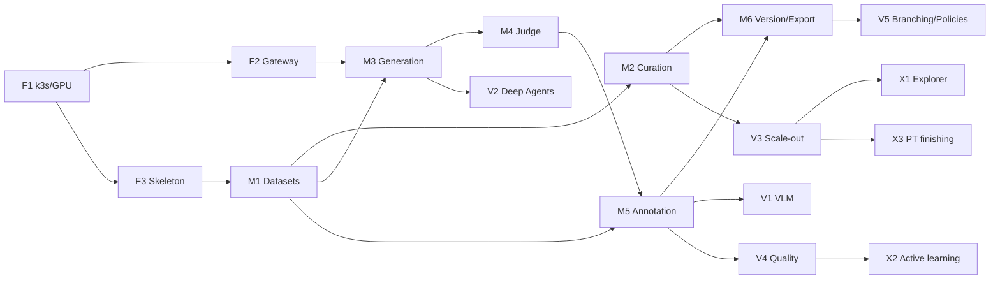

# TASK.md — Forge Implementation Plan

Status: v1.0 · Companion docs: [RESEARCH.md](RESEARCH.md), [ARCHITECTURE.md](ARCHITECTURE.md)

**Team assumption:**
- 1 tech lead/architect
- 2 backend engineers (Python/FastAPI) and 2 frontend engineers (Next.js/TS)
- 1 data/ML engineer (curation + generation) and 1 DevOps/platform engineer (k3s/GB10)
- 0.5 security and 0.5 PM/design

Estimates are in engineer-weeks (ew), and sprints are 2 weeks.

**Definition of Done (all stories):** a story is done when all of the following hold:
- Code reviewed, with unit and integration tests.
- OpenAPI updated and docs updated.
- Runs on arm64 k3s staging with no privileged pods.
- Secrets come via ESO, and OTel spans are present.
- A tenant-isolation test covers any new data-access path.

## Milestones

| Milestone | Target | Exit criteria |
|---|---|---|
| **M0 Foundation** | Week 4 | arm64 k3s staging with GPU Operator, LiteLLM → vLLM route, Keycloak login, multi-arch CI |
| **M1 MVP** | Week 14 | Import → curate (lang ID, heuristics, exact + MinHash dedup, PII) → generate SFT/DPO via LangGraph → judge → annotate text (label/rating/ranking/pairwise/chat edit) → version → export JSONL/Parquet/ShareGPT/ChatML/DPO/HF |
| **M2 v1** | Week 28 | VLM annotation (bbox/VQA/caption), Deep Agents dataset builder with HITL, Ray-scale curation (TB-level), semantic dedup, judge calibration, IAA/adjudication, branching, policy-gated exports |
| **M3 v2** | Week 44 | Dedicated tenancy tiers, Lilac-style cluster explorer, active learning, classifier training loop, Megatron/WebDataset exports, decontamination, Temporal evaluation, audit/compliance pack |

---

## Phase 0 — Foundation (Weeks 1–4)

### EPIC F1: ARM64 k3s platform on DGX GB10 (DevOps) — 5 ew

| ID | Task | Acceptance criteria | Dep | Est |
|---|---|---|---|---|
| F1.1 | Install k3s HA (3 servers, embedded etcd) natively on DGX OS; verify cgroup v2 | All GB10 nodes Ready; node-reboot test passes | — | 1 ew |
| F1.2 | NVIDIA GPU Operator with device plugin ≥ v0.17.4; DCGM exporter | Pod requesting `nvidia.com/gpu: 1` runs `nvidia-smi`; plugin stable on UMA | F1.1 | 1 ew |
| F1.3 | Pod Security Admission `restricted` on forge namespaces; Kyverno (no privileged, digest-pinned, signed images) | Privileged test pod is rejected | F1.1 | 1 ew |
| F1.4 | Harbor registry mirror + air-gap image sync; Argo CD bootstrap | All charts deploy from Git; no public pulls in prod | F1.1 | 1 ew |
| F1.5 | OpenBao/Vault + External Secrets; CloudNativePG; Valkey; S3-compatible store bake-off on arm64 (ADR-006) | App reads DB creds via ESO; object store passes multipart/presign/versioning smoke tests | F1.1 | 1 ew |

### EPIC F2: Model gateway (DevOps + ML) — 2.5 ew

| ID | Task | Acceptance criteria | Dep | Est |
|---|---|---|---|---|
| F2.1 | vLLM CUDA-13 image (NGC 26.02+ or cu130), non-root, pinned digest; one generator + one embedding model | OpenAI-compatible endpoint served; `/metrics` scraped; non-privileged | F1.2 | 1 ew |
| F2.2 | LiteLLM from `ghcr.io/berriai/litellm` (arm64 verified), HA Postgres; routes `gen-default`, `judge-default`, `embed-default`; admin key in Vault | Budgeted virtual key created via API; exhaustion returns 4xx; arm64 smoke test per upgrade in CI | F2.1 | 1 ew |
| F2.3 | NetworkPolicies: forge → LiteLLM → vLLM only | Direct test-pod call to vLLM is blocked | F2.2 | 0.5 ew |

### EPIC F3: Engineering skeleton — 4 ew

| ID | Task | Acceptance criteria | Est |
|---|---|---|---|
| F3.1 | Monorepo (uv + pnpm), pre-commit, ruff/mypy/ESLint; buildx multi-arch; cosign; Trivy; gitleaks | PR builds arm64 images; blocks on critical CVEs/secrets | 1.5 ew |
| F3.2 | FastAPI skeleton: settings, OTel, structured logs, RFC 9457 errors, health/readiness, OpenAPI → TS client | Generated client compiles in web app | 1 ew |
| F3.3 | Next.js skeleton: App Router, BFF auth handlers, shadcn/ui + Tailwind | Authenticated page renders `/v1/me` | 1 ew |
| F3.4 | Keycloak realm, OIDC PKCE via BFF, `get_principal()` + `SET LOCAL forge.tenant_id` + RLS template | Automated test: tenant A cannot read tenant B via any endpoint | 0.5 ew + security review |

**M0 gate:** demo the following end to end.
1. Log in.
2. Call `GET /v1/me`.
3. Make a chat completion through LiteLLM with a minted virtual key.
4. Show the traces in Tempo/Langfuse.

---

## Phase 1 — MVP (Weeks 5–14)

### EPIC M1: Datasets, schema and records — 5 ew

| ID | Task | Acceptance criteria | Dep | Est |
|---|---|---|---|---|
| M1.1 | Dataset endpoints; schema with field/question defs (text, chat, label, multi-label, rating, ranking, pairwise, text, chat_edit) | Invalid settings rejected with problem+json | F3 | 1.5 ew |
| M1.2 | Lance record store on S3: bulk add (≤10k), get, cursor scan, filter DSL | 1M-record dataset next-page p95 < 200 ms; DSL fuzz test proves no arbitrary SQL | F1.5 | 2 ew |
| M1.3 | Import jobs (Arq): JSONL/Parquet/CSV, HF mirror, S3 prefix | 500k-row import with SSE progress; resumes after worker kill | M1.2 | 1.5 ew |

### EPIC M2: Curation MVP — 6 ew

| ID | Task | Acceptance criteria | Dep | Est |
|---|---|---|---|---|
| M2.1 | Operator interface + registry; DataTrove filter adapters (Gopher, C4, FineWeb); fastText lang ID | Every rejected row has `reject_reason`; per-stage stats | M1.2 | 2 ew |
| M2.2 | Exact dedup + MinHash-LSH (5-gram, 14×8 default) on Ray | On 10M-doc sample, recall ≥ 0.9 vs brute-force Jaccard ≥ 0.8 on labelled subset; cluster IDs stored | F1, M1.2 | 2 ew |
| M2.3 | PII operator (Presidio + regex): tag/redact/hash | ≥ 98% of seeded emails/IPs/phones redacted; redaction map encrypted | M2.1 | 1 ew |
| M2.4 | Token stats (configurable tokenizer); resumable stage manifests | Kill + resume yields identical output hash | M2.1 | 1 ew |

### EPIC M3: Generation engine MVP (LangGraph) — 6 ew

| ID | Task | Acceptance criteria | Dep | Est |
|---|---|---|---|---|
| M3.1 | Pipeline spec schema → LangGraph compiler; Step/Task/Combine/Validator; Postgres checkpointer | Invalid DAG (cycle, missing column) rejected at validation | M1.2 | 2 ew |
| M3.2 | Task library v0: self-instruct, evol-instruct, multi-response, QA-from-document, chat simulation | Golden snapshot tests with mock LLM | M3.1 | 1.5 ew |
| M3.3 | LiteLLM client: per-run key mint/revoke, route semaphores, guided JSON, response cache | Unchanged rerun makes zero LLM calls; budget exhaustion → `failed: budget_exceeded` | F2.2 | 1.5 ew |
| M3.4 | Preview (≤ 50 rows) and run endpoints with SSE | 20-row preview < 60 s on `gen-default` | M3.1 | 1 ew |

### EPIC M4: LLM-as-judge MVP — 3 ew

| ID | Task | Acceptance criteria | Dep | Est |
|---|---|---|---|---|
| M4.1 | Versioned judge definitions: pointwise rubric, pairwise with position swap | Both orders run; agreement recorded | M3.3 | 1.5 ew |
| M4.2 | DPO pair builder (margin threshold); low-margin routing to annotation queue | Routed items appear in queue with suggestions | M5.1 | 1.5 ew |

### EPIC M5: Annotation workspace (text) — 8 ew

| ID | Task | Acceptance criteria | Est |
|---|---|---|---|
| M5.1 | Queues + leases (`SKIP LOCKED`, TTL, WS heartbeat), overlap-k | 50 concurrent annotators, zero double assignments in load test; expired leases return to pool | 2 ew |
| M5.2 | Annotator UI: markdown/code/chat renderer; label, multi-label, rating, rubric, ranking (drag), pairwise (tie/both-bad + rationale), free text, chat-turn edit; shortcuts; autosave | Next-record p95 < 150 ms; full keyboard flow for pairwise; WCAG AA contrast | 4 ew |
| M5.3 | Suggestion display with provenance; accept/edit | Suggestion and final answer both stored | 1 ew |
| M5.4 | Lead dashboard: progress, throughput, agreement % | Live counters via SSE | 1 ew |

### EPIC M6: Versioning and export MVP — 4 ew

| ID | Task | Acceptance criteria | Est |
|---|---|---|---|
| M6.1 | Commit draft → version (Lance version + Postgres row + manifest hash + stats); tags | Versions immutable; re-export byte-identical | 1.5 ew |
| M6.2 | Exporters: JSONL, Parquet, HF datasets (push to internal registry), ShareGPT, ChatML/OpenAI, Alpaca, DPO, KTO; `export_manifest.json` | DPO export loads in TRL `DPOTrainer` smoke test; SFT loads via `datasets.load_dataset` | 2.5 ew |

### EPIC M7: Observability & security MVP — 3 ew

| ID | Task | Acceptance criteria | Est |
|---|---|---|---|
| M7.1 | Self-hosted Langfuse; LangChain/LangGraph + LiteLLM callbacks; PII redaction hook | Each run links to its traces; per-run cost aggregated | 1 ew |
| M7.2 | Grafana dashboards: API, vLLM, LiteLLM, Ray, GPU | Dashboards in Git, provisioned by Argo | 1 ew |
| M7.3 | Security suite: cross-tenant access, CRUD-passthrough lint, PSA conformance, secret scan | Green in CI; pen-test checklist v0 signed off | 1 ew |

**Phase effort:**
- Phase 0: ≈ 11.5 ew
- MVP: ≈ 35 ew

**M1 demo script**
1. Import 1M web docs.
2. Curate them (lang ID, heuristics, MinHash, PII) and commit v1.
3. Generate 5k SFT and 2k DPO candidates from the curated docs.
4. Run the judge.
5. Have 3 annotators label 300 low-margin pairs, then commit v2.
6. Export ChatML and DPO.
7. Run a TRL smoke-train.

---

## Phase 2 — v1 (Weeks 15–28)

### EPIC V1: Multimodal (VLM) data — 9 ew

| ID | Task | Acceptance criteria | Est |
|---|---|---|---|
| V1.1 | Image fields: content-addressed upload, thumbnails, EXIF stripping, pHash dedup | Duplicate uploads stored once | 1.5 ew |
| V1.2 | Konva canvas: bbox, polygon, keypoints; VQA (optional region grounding); caption edit; image-grounded pairwise | 500 boxes on a 4K image at 60 fps; exports COCO-style and LLaVA conversations | 4 ew |
| V1.3 | VLM tasks: captioning, VQA generation, image-grounded preference via `vlm-default`; VLM judge | Preview works end to end on VLM route | 2 ew |
| V1.4 | Image curation ops: CLIP-score, resolution/aspect, NSFW | Rejections carry reasons | 1.5 ew |

### EPIC V2: Deep Agents dataset builder — 7 ew

| ID | Task | Acceptance criteria | Est |
|---|---|---|---|
| V2.1 | `create_deep_agent` service: composite FS (Store namespaced by tenant/session), deny-by-default `FilesystemPermission`, typed tools, per-session budget | Red-team: no cross-tenant reads, no non-allow-listed tools, budget enforced | 3 ew |
| V2.2 | Subagents: schema-designer, prompt-engineer, quality-analyst, curation-planner | Valid spec + 20-row preview within 10 min for 4 of 5 benchmark briefs | 2 ew |
| V2.3 | HITL UI: plan view, spec diff, approve/reject interrupts, streamed tool calls | No side-effecting tool runs without an approval record in audit | 2 ew |

### EPIC V3: Scale-out curation — 6 ew

| ID | Task | Acceptance criteria | Est |
|---|---|---|---|
| V3.1 | KubeRay autoscaling (CPU + GPU pools), GCS fault tolerance | Head-pod kill recovers running job | 1.5 ew |
| V3.2 | Distributed MinHash with union-find on Ray actors; WARC + Trafilatura at scale | 1 TB text deduplicated end to end with documented throughput; resumable | 2.5 ew |
| V3.3 | Semantic dedup (vLLM embeddings + k-means) and model quality classifiers | Configurable thresholds; stats per cluster | 2 ew |

### EPIC V4: Annotation quality — 4 ew

| ID | Task | Acceptance criteria | Est |
|---|---|---|---|
| V4.1 | Gold/honeypot items, Krippendorff's α / Cohen's κ, per-annotator accuracy | Metrics on dashboard | 1.5 ew |
| V4.2 | Reviewer adjudication and consensus resolution | Adjudicated value becomes canonical response | 1.5 ew |
| V4.3 | Judge calibration vs human labels; "calibrated judges only" export policy | Judge with κ below threshold cannot gate export | 1 ew |

### EPIC V5: Versioning & export v1 — 3 ew
- **V5.1** Branches, two-parent merges and a row-level diff UI. *Est:* 1.5 ew.
- **V5.2** Export policies (license, PII-clean, judge calibration) and WebDataset shards. *Est:* 1.5 ew.

### EPIC V6: Ingestion v1 — 3 ew
- **V6.1** A polite URL crawler (robots.txt, per-domain rate limits, license/opt-out tags). *Est:* 1.5 ew.
- **V6.2** Document parsing (Unstructured OSS with analytics off, pdfium fast path) and VLM OCR for scans. *Est:* 1.5 ew.

### EPIC V7: RBAC & ops hardening — 3 ew
- **V7.1** A Cerbos/OPA policy engine with the ARCHITECTURE §10 roles, plus dataset sensitivity labels. *Est:* 1.5 ew.
- **V7.2** Backups (CNPG WAL, bucket versioning, Velero), a restore drill and runbooks. *AC:* RPO ≤ 15 min and RTO ≤ 4 h achieved in the drill. *Est:* 1.5 ew.

**v1 total ≈ 35 ew.**

---

## Phase 3 — v2 (Weeks 29–44)

| Epic | Scope | Acceptance criteria | Est |
|---|---|---|---|
| **X1 Data explorer (Lilac-style)** | Embedding clusters with LLM titles, semantic + keyword search, facets over accepted/rejected, bulk re-queue/reject/tag | Cluster 4M docs < 1 h on batch node; filter < 1 s on 10M rows | 5 ew |
| **X2 Active learning & label quality** | Uncertainty/disagreement prioritization; confident-learning label-issue scores; retrain quality classifiers from human labels | ≥ 20% fewer annotations to reach target agreement on benchmark task | 4 ew |
| **X3 Pretraining finishing** | n-gram decontamination vs registered eval sets; mixing recipes with token budgets; Megatron `.bin/.idx` export; per-mixture tokenizer stats | Contaminated version blocked from export | 4 ew |
| **X4 Multi-tenancy tiers** | Dedicated namespace/DB tenants, per-tenant redaction keys, quotas and chargeback (tokens, GPU-hours, storage) | Chargeback report per tenant per month | 4 ew |
| **X5 Advanced generation** | Verifier-based rejection sampling (sandboxed code, math checkers), agentic trajectory synthesis, offline vLLM on Ray for > 1M rows | 1M-row offline job completes with cost accounting | 4 ew |
| **X6 Orchestration review** | Evaluate Temporal for cross-system sagas | ADR updated | 1 ew |
| **X7 Compliance pack** | Audit export to SIEM, retention policies, per-export lineage report (sources, licenses, models, annotators), external pen test | Pen-test criticals closed | 3 ew |

**v2 total ≈ 25 ew + hardening buffer.**

---

## Dependency Graph (critical path)

## Risks & Mitigations

| Risk | Likelihood | Impact | Mitigation |
|---|---|---|---|
| vLLM/CUDA-13 image lag or breakage on sm_121 | High | High | Internal hardened vLLM base; pinned digests; canary node |
| LiteLLM arm64 image regressions | Medium | High | Pull from ghcr.io; CI arm64 smoke test per upgrade; keep previous digest for rollback |
| Unified-memory contention (vLLM vs Ray on same box) | High | Medium | Taints/tolerations, dedicated serve nodes, conservative `gpu-memory-utilization` |
| Upstream operator API churn (NeMo Curator, Data-Juicer) | Medium | Medium | Adapter layer, pinned versions, contract tests |
| Agent unreliability | Medium | Medium | Agents plan only; deterministic execution; benchmark briefs in CI |
| Object-store licensing/distribution change | Medium | Medium | S3-API abstraction; bake-off in F1.5 |
| Annotation UX underestimated | High | Medium | Design sprint in week 5; usability test with 5 annotators before M1 |

## Open Questions (resolve by Week 4)
1. Which generator, judge and VLM models are approved for internal use (license review)?
2. Is any external model API permitted for non-restricted data?
3. What is the expected corpus scale for year 1, in TB? This sizes the Ray pool and storage.
4. Should datasets reach training clusters via an internal HF Hub mirror or a plain registry?
5. Are annotators internal only, or will external contractors be used? This affects PII policy and RBAC.
